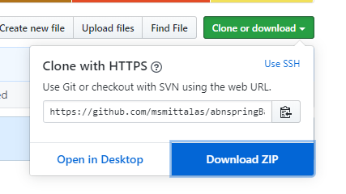
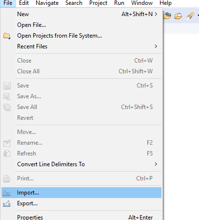
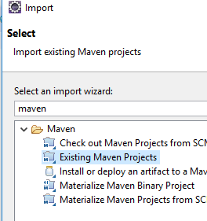
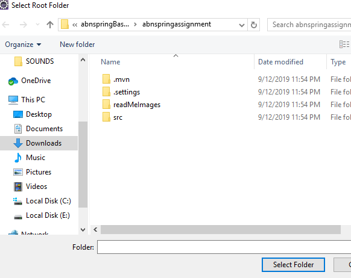
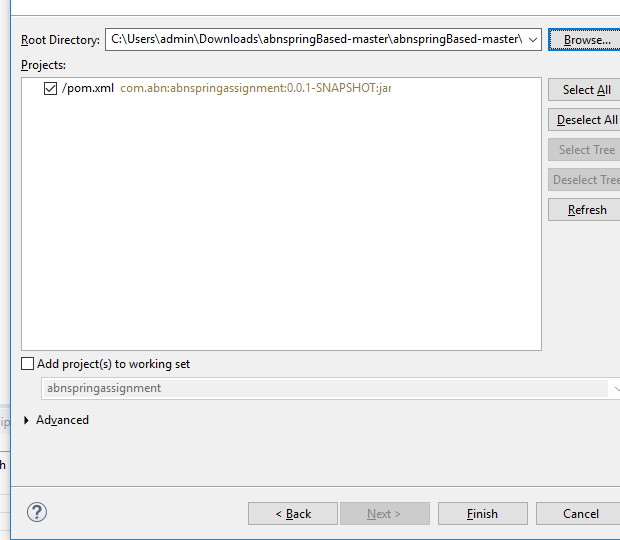
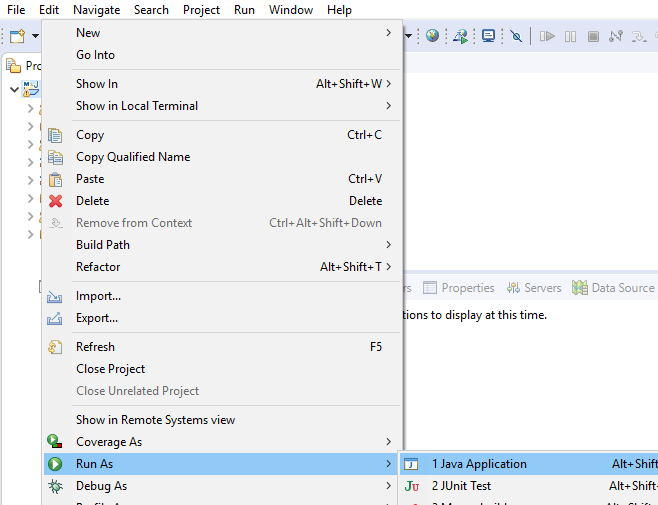
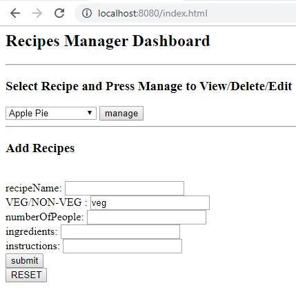
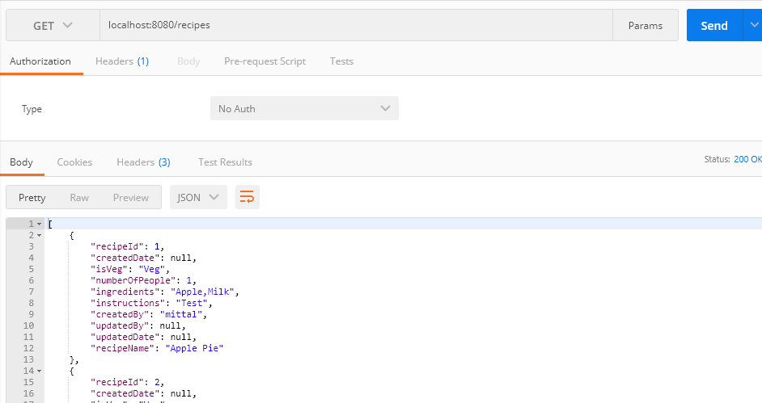
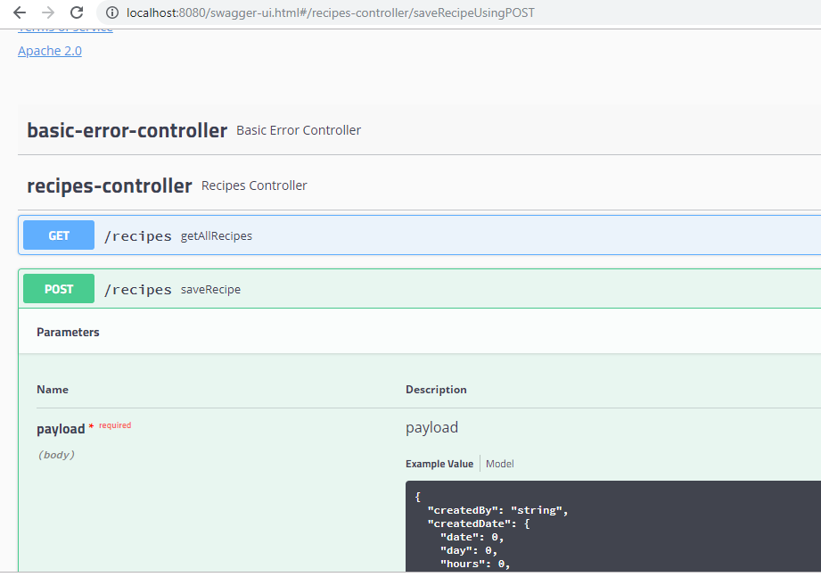

# Recipes Manager

* Simple Web Rest API project which can add, remove, update and getAll Recipes added by User. this project created with Spring boot, H2 Database, Maven, Spring REST  and Spring Web.
* Earlier  I had created the same project using Servlet/Rest/JSP. where I had not used any spring components as I was having limited knowledge about spring boot. I had created that project in 1 day.  you check that project here --> https://github.com/msmittalas/abpamorassignmet
* Since I wanted to learn more about spring boot and related stuff, I did the same project in Spring boot. it took around 2 days to learn and develop this project. 

## Technologies and Tools Used
* Spring Boot,JPA,WEB,Test  2.1.8
* H2 Embedded Database   1.4.199
* Swagger for Documentations  2.9.2
* JUnit  4.12
* Hibernate 5.3.11
    

## Getting Started

These instructions will get you a copy of the project up and running on your local machine for development and testing purposes.

### Prerequisites

What things you need to install the software and how to install them
* JDK 1.8
* MAVEN 
* Eclipse 

### Installing 

You can use Eclipse to start the project in local or you can simply use mvn and java command to start the project in local

##### Install App using Eclipse
A step by step series of examples that tell you how to get a development env running using Eclipse

Download the source code in the local machine

 
 In Eclipse , Import the Project using Import as Maven Project.

We can easily run the project and no special instructions are required as Application is developed using Spring Boot and used Embedded DB . 
Post Build, You can  Click 	Run As --> Java Application.

	 
Goto http://localhost:8080/index.html  and  open Simple UI  

OR You can Open any REST Tester for example POSTMAN, to test the services  
  

### View REST API Documentations
 * After starting Application goto -> http://localhost:8080/swagger-ui.html  to check the API Documentation
   
   
## Built With

* [SpringBoot](https://spring.io/projects/spring-boot) - The Spring framework for REST and web
* [Maven](https://maven.apache.org/) - Dependency Management
* [SWAGGER](https://swagger.io/) - Used to generate REST Documentations

## Authors

* **MITTAL SHAH**  

## Acknowledgments

* Referred  https://spring.io/guides/gs/rest-service/  for REST Codes 
* Referred  https://spring.io/guides/gs/accessing-data-jpa/ for JPA 
* Referred  https://dzone.com/articles/spring-boot-restful-api-documentation-with-swagger for Swagger Integration